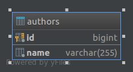

# Ruby Dynamic Class Creator

For each table in database, create a abstracted class of Sequel Model and exposes in a sinatra-web-app

### A micro service based on sinatra and sequel application that automatically creates RESTful apis from the database tables

## Getting Started

These instructions will get you a copy of the project up and running on your local machine for development and testing purposes. See deployment for notes on how to deploy the project on a live system.

### Prerequisites

A whatever postgresql database with data.
```
there are some examples in the sql folder...
```

### Configuring

First change the database.conf.yml file and enter the credentials of your database
 

```
host: **localhost**
user: **postgres**
password: **postgres**
database: **samples**
port: **5432**
```

And 

```
rackup config.ru
```

You shall see
```
[Startup Info] - Postgresql streaming was activated.
Creating class: Dynamics::Authors
Creating class: Dynamics::Categories
Creating class: Dynamics::AuthorsBooks
Creating class: Dynamics::Books
Extending Dynamics::Authors
Extending Dynamics::Categories
Extending Dynamics::Books
Extending Dynamics::AuthorsBooks
[2018-03-31 09:21:44] INFO  WEBrick 1.4.2
[2018-03-31 09:21:44] INFO  ruby 2.5.0 (2017-12-25) [x86_64-linux]
[2018-03-31 09:21:44] INFO  WEBrick::HTTPServer#start: pid=8686 port=8089
```

The server is UP.

now with your preferred api tool test manager or in a browser access:

```
http://0.0.0.0:8089/api/tables/authors
http://<ip>:<port>/api/<route>
```

Consider the example table



You shall see
```
{"authors":[{"id":1,"name":"Felipe"},
{"id":2,"name":"Ronaldo"},
{"id":3,"name":"Jose"},
{"id":4,"name":"author 1"},
(...)
]}
```

## Features
  1 Show tables
   - GET <host>/api/tables
   
  2 Return rows for table
   - GET <host>/api/tables/<table_name>
   
  3 Return a row in current table
   - GET <host>/api/tables/<table_name>/<id_>
   
  4 Return a list of current table in pagination mode
   - GET <host>/api/tables/<table_name>/<page_>/<limit_> 
   
  5 Delete a row in current table
   - DELETE <host>/api/tables/<table_name>/<id_>
   
  6 Persist values in current table
   - POST <host>/api/tables/<table_name>
   
  7 Update values in current table
   - PUT <host>/api/tables/<table_name>/<id_>   
           
  8 Show possible columns in a current table
   - GET <host>/columns/<table_name>         
   
  9 Show required columns in a current table
   - GET <host>/required/<table_name>         
                 
  10 Show optional columns in a current table
   - GET <host>/optional/<table_name>   

## Built With

* [Sinatra](https://github.com/sinatra/sinatra) - Classy web-development dressed in a DSL
* [Sequel](https://github.com/jeremyevans/sequel) - Sequel: The Database Toolkit for Ruby 

## Contributing

Please read [CONTRIBUTING.md](CONTRIBUTING.md) for details on our code of conduct, and the process for submitting pull requests to us.

## Versioning

We use [SemVer](http://semver.org/) for versioning. For the versions available, see the [tags on this repository](https://github.com/your/project/tags). 

## Authors

* **Felipe Rodrigues Michetti** - *Main Developer*

See also the list of [contributors](https://github.com/frmichetti/dynamic_class_creator/contributors) who participated in this project.

## License

This project is licensed under the GPL License - see the [LICENSE.md](LICENSE.md) file for details

## Acknowledgments

* Sinatra and Sequel
Responsible's and collaborator's
